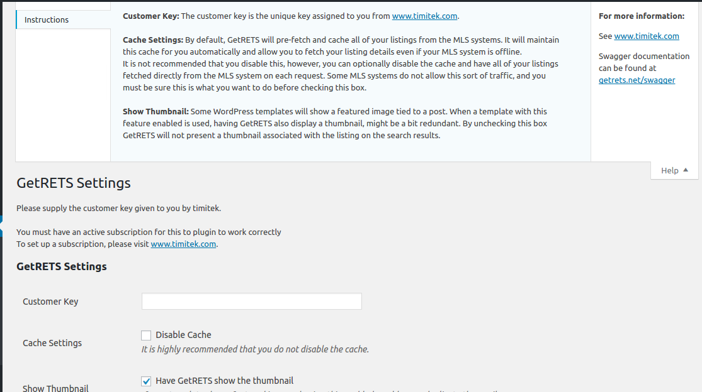
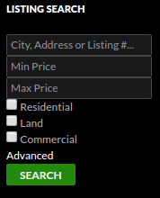
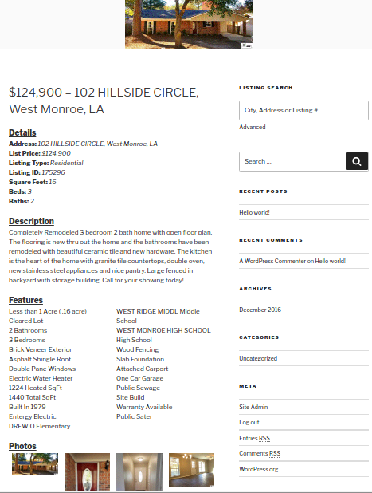
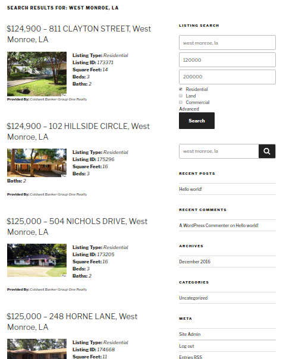

#GetRETS&reg; WordPress Plugin Guide

***

*URL:* <http://www.timitek.com>

*Contact:* **<support@timitek.com>**

*Version:* **1.0.3**

*Demo:* <http://wordpress.timitek.com> 

***

##Table of Contents

1. Description
2. Screenshots
3. Requirements
4. Installing
5. Setup
6. Advanced Listing Search Widget
7. Shortcodes
8. Extending Via CSS
9. Extending Via JavaScript
10. License
11. Release Notes

##1. Description

Instantly add real estate listing data to your website.  This WordPress plugin will allow your listings, from multiple feeds, to appear within your site as native content, treated just like other content on your website.  All of this is done through an integration with GetRETS&reg; from timitek, llc.

GetRETS is an API that provides integration with RETS based MLS's through a RETSful API.

##2. Screenshots

> *Settings - GetRETS*

> *Create your own search page using the [getrets-search] shortcode*

![Create your own search page using the [getrets-search] shortcode](../screenshot-2.png "Create your own search page using the [getrets-search] shortcode")

> *Take advantage of the advanced listing search search widget*

> *View listing searches natively in your site like any other post*

> *View a detailed post for listings with detailed information and photos*

##3. Requirements

Please ensure you meet the following requirements:

- PHP 5.4.45+
- Either cUrl enabled or allow_url_fopen enabled in php.ini
- WordPress 4.6.1 or later
- An active subscription and customer key for **GetRETS** from **timitek** (<http://www.timitek.com>)

##4. Installing

### From Within WordPress

1. From the WordPress administration dashboard, select **Plugins** - **Add New**.
2. Search for **GetRETS**.
3. Click the **Activate** button.

### Alternate Install (With Zip File)

**Note** - *It might be necessary to provide ftp information for this method.*

1. Download the **\*.zip** file.
2. From the WordPress administrators dashboard, select **Plugins** - **Add New**.
3. Click the **Upload Plugin** button.
4. Upload the **\*.zip** file that was previously downloaded.
5. After uploading, activate the plugin.

### Manual Installation

1. Download the **\*.zip** file.
2. Extract the contents of the **\*.zip** into the `wp-content/plugins` directory of your WordPress installation.

##4. Setup

**Note** - *Ensure the Plugin has been activated in the WordPress administration dashboard before continuing.*

Access the **GetRETS** settings from the WordPress administrators dashboard.

From the WordPress administration dashboard, select **Settings** - **GetRETS**.

There are two settings for you to configure.
* **Customer Key**: The customer key is the unique key assigned to you from <http://www.timitek.com>.
* **Cache Settings**: By default, GetRETS will pre-fetch and cache all of your listings from the MLS systems. It will maintain this cache for you automatically and allow you to fetch your listing details even if your MLS system is offline.
It is not recommended that you disable this, however, you can optionally disable the cache and have all of your listings fetched directly from the MLS system on each request. Some MLS systems do not allow this sort of traffic, and you must be sure this is what you want to do before checking this box. 
* **Show Thumbnail**: Some WordPress templates will show a featured image tied to a post.  When a template with this feature enabled is used, having GetRETS also display a thumbnail, might be a bit redundant.  By unchecking this box GetRETS will not present a thumbnail associated with the listing on the search results.

### Congratulations
You have successfully installed GetRETS and visitors to your site can immediately start using your site to search for realty listings using the regular search features of WordPress!

##6. Advanced Listing Search Widget

### About

GetRETS integrates with the default WordPress search immediately out of the box after setup.  However, if you would like to enable a more advanced search, the GetRETS plugin also includes a Search Widget, which once enabled, will allow visitors to your site to specify additional constraints to search listings by.

In addition to the generic keyword search, the following constraints are made available;

* Minimum Price
* Maximum Price
* Residential Listings
* Land Listings
* Commercial Listings

### Enabling

1. From the WordPress administration dashboard, select **Appearance** - **Widgets**.
2. From the **Available Widgets** section, select **GetRETS Search**.
3. Based on the theme you have installed, select the sidebar / area where you want your widget to be displayed at on your site.
4. Click the **Add Widget** button
5. You may customize the title to be used for the for the widget.

### Finally

Now your sites visitors can perform more advanced listing searches!

##7. Shortcodes

### Advanced Search

In addition to the the search widget, the GetRETS plugin provides a `[getrets_search]` shortcode for you to use in a post or page to create a more customized search page.  This short code provides a search form with the same advanced searching functionality as the widget.

### How To Use

Place the following line in any page / post.

`[getrets_search]`

##8. Extending Via CSS

The post content detail elements are marked up with several CSS classes that can be used to customize the look and feel of the listing details post.

### Main Content

`getrets-content`

This is class used for the main div that surrounds all of the content for the listing details post.

### Sections

Each of the 4 sections are wrapped in a div that has it's own class.
* Details - `getrets-details`
* Description - `getrets-description`
* Features - `getrets-features`
* Photos - `getrets-features` 

### Titles

`getrets-title`

This is the title for each of the 4 sections.
* Details
* Description
* Features
* Photos

### Detail Entries

`getrets-detail`

Each entry in the **Details** section has a div around it with the`getrets-detail` class applied to it.

### Labels / Values

`getrets-label` / `getrets-value` 

This `getrets-label` class is applied to each label used for each detail item in the Details section, as well as the **Provided By:** label.

Likewise, the `getrets-value` class is applied to each value after the label.

### Photos

`getrets-photo`

Each photo has the `getrets-photo` class applied to it.

### Further Details

For further information examine the markup at; 

`wp-content/plugins/getrets/views/frontend/content.php`

##9. Extending Via JavaScript

In addition to extending the the listing details post via custom styles in your theme, you can also extend functionality via JavaScript.

### listingLoaded Function

Each listing detail post will attempt to inject listing detail information and a list of images for the listing into a global function if your theme enables it.

To take advantage of this create a public function with the following syntax, that will be called when a listing detail post is displayed.

    /**
    * Function that is called by GetRETS when a listing
    * detail post is loaded.
    * 
    * listing - JSON object representing the details
    *           of the listing
    * images  - an array of image urls associated
    *           with this listing
    */
    function listingLoaded(listing, images) 
    { 
        alert(listing.description);
    }

### Element Attributes
Each element that is rendered is also rendered with an intuitive id to make it easy to allow for DOM manipulation.

For further information examine the markup at; 

`wp-content/plugins/getrets/views/frontend/content.php`

##10. License

Creative Commons Attribution-NoDerivatives 4.0 
<http://creativecommons.org/licenses/by-nd/4.0/legalcode>

##11. Release Notes

### Version 1.0.0 - Initial Release

* Return listings in search results
* View listing details as a custom post type
* Advanced search shortcode
* Advanced search widget
* Listing detail post rendered with CSS classes and JavaScript hooks

### Version 1.0.1

* Added support for cUrl as backup for use in working with API when allow_url_fopen is not enabled

### Version 1.0.2

* Removed duplicate ID's from search result excerpt

### Version 1.0.3

* Fix for php versions before 5.5 (no empty checks) - Line 118 of GetRETS.php.
